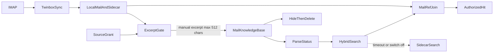
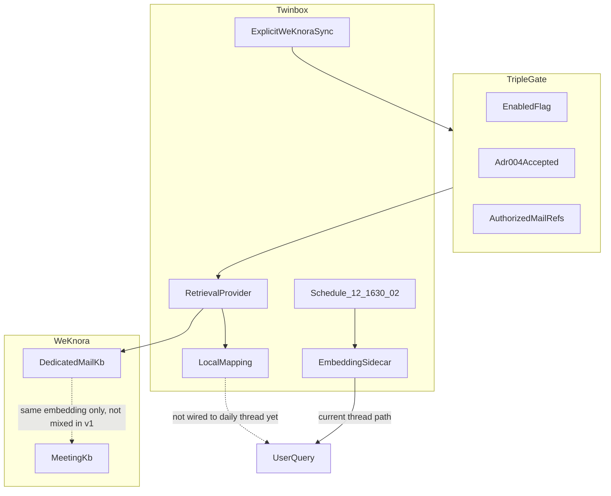

# WeKnora 与 Twinbox 审阅图

**日期**：2026-09-24  
**性质**：审阅材料。不改调度，不开 `weknora.enabled`，不勾 T008/T009/T010、BV 或 ROI。  
**现状**：邮件知识库有效副本为 0。最近 N=1 样本已撤权。同步入口只有显式 `twinbox weknora sync`。`search_excerpts` 还没接到日常 `thread`。

## 数据流

Twinbox 保留原文、分类和当前状态。知识库只收授权范围内的有界摘录。命中用 `mail_ref` 回到 Twinbox。超时或开关关闭时走 sidecar。

## 架构

`12:00` / `16:30` / `02:00` 只驱动 Twinbox 自己的同步和 sidecar。它们不调用知识库写入。

## 换库与多个适配器

切换点在 [twinbox/twinbox_core/weknora.py](../../../twinbox_core/weknora.py) 的 `WeKnoraProvider`：查找、创建、更新、解析状态、检索、删除。IMAP、调度、sidecar、grant 和 `mail_ref` 映射不依赖某一家 URL。

[twinbox/twinbox_core/weknora_http.py](../../../twinbox_core/weknora_http.py) 是 WeKnora 的一种实现。另一家知识库实现同一端口即可替换。多家可以并存，每家各自带开关、grant 和知识库。检索选定一家，或分别返回并标明来源。不同库的分数不混排，邮件库和会议库不并成一次查询。

CLI、配置键和模块名仍叫 `weknora`。换库时改这一层，不改邮件同步节奏。对方做不到检索前隔离、稳定幂等键或删除时，该适配器保持关闭，继续用 sidecar。
